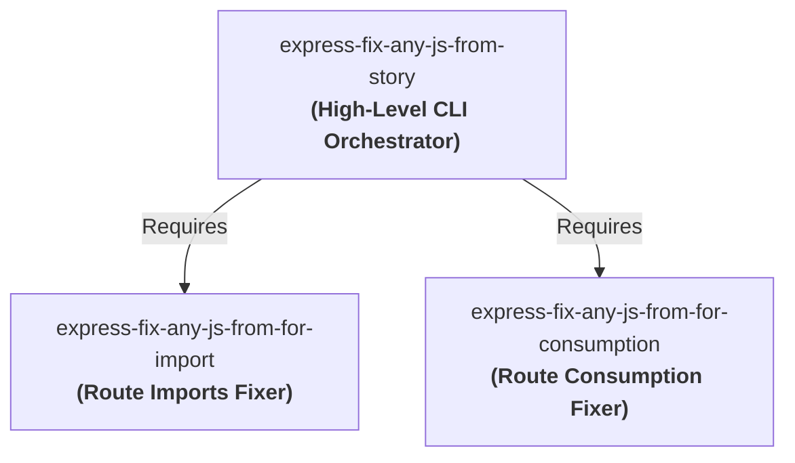

# express-fix-any-js-from-for-import 🚀

> **Idempotent & Clean Route Imports Builder. Intelligently scans, injects, and aligns routing import statements at the top of Javascript files.**

[](https://www.npmjs.com/package/express-fix-any-js-from-for-import)
[](LICENSE)

---

## 📖 The Story of the 3 Repositories

This package handles the top-level **imports** layer in our modular route-fixing ecosystem. It is designed to work in alignment with two other packages:



1. **[express-fix-any-js-from-for-import](https://github.com/keshavsoft/express-fix-any-js-from-for-import)** *(This Repository)*: Focuses strictly on inspecting, formatting, and injecting route/router **import statements** cleanly at the top of Javascript files without duplication.
2. **[express-fix-any-js-from-for-consumption](https://github.com/keshavsoft/express-fix-any-js-from-for-consumption)**: Focuses strictly on inspecting, formatting, and injecting route/router **consumption lines** (`router.use(...)` or `router.post(...)`) in the body of the routes initialization block.
3. **[express-fix-any-js-from-story](https://github.com/keshavsoft/express-fix-any-js-from-story)**: The master orchestrator. It receives generation specifications (stories) and coordinates both the **import fixer** and the **consumption fixer** to safely build and update full routing definitions.

---

## ✨ Features

*   **🔒 Strict Idempotency**: Prevents adding duplicate imports regardless of repeated builders runs.
*   **📐 Layout Spacing**: Inserts imports cleanly at the top relative to existing ES imports or CommonJS requires.
*   **⚡ Cascade Dependency**: Automatically triggers dependents notification builds downstream upon successful publishing.

---

## 🚀 Quick Start

### Installation

```bash
npm install express-fix-any-js-from-for-import
```

### Programmatic Usage

```javascript
import alterFileImports from 'express-fix-any-js-from-for-import';

alterFileImports({
  jsFilePath: './routes/end-points.js',
  toInsertLine: "import GetRoutes from './routes/GetRoutes.js';",
  duplicationCheck: "import GetRoutes"
});
```

---

## 🛠[]() Developer Technical Guides

For more details on the orchestration system:
*   [Developer Docs Home](./docs/index.html)
*   [Orchestration CLI documentation](https://github.com/keshavsoft/express-fix-any-js-from-story)

---

## ⚖️ License

MIT License. Designed with ❤️ by [KeshavSoft](https://github.com/keshavsoft).
